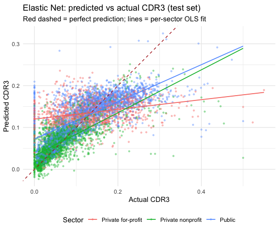

## Setup

The Phase 1 cleaning script already handled leakage (RPY\_3YR\_RT and
earnings columns dropped) and the COVID payment-pause years (filtered to
`year <= 2019`), so we just load and go.

    library(tidyverse)
    library(tidymodels)
    library(here)
    library(lme4)
    library(performance)

    panel <- read_csv(here("data/processed/distress_primary.csv"),
                      show_col_types = FALSE) %>%
      mutate(across(c(CONTROL, PREDDEG, REGION, LOCALE), as.factor)) %>%
      select(-distressed)  # would leak: it's just (CDR3 > 0.10)

## Train / test split

Each school appears in multiple years. A row-level random split puts the
same school in both halves and the model just learns school identity.
Sampling whole schools instead.

    set.seed(42)
    test_schools <- sample(unique(panel$UNITID),
                           round(0.2 * n_distinct(panel$UNITID)))

    train <- filter(panel, !UNITID %in% test_schools)
    test  <- filter(panel, UNITID %in% test_schools)

## Elastic net

A prior 20 × 6 grid sweep over `(penalty, mixture)` on 5-fold grouped CV
landed on a flat region — many configurations tied — so we use the
chosen point directly and skip re-tuning each knit.

    en_recipe <- recipe(CDR3 ~ ., data = train) %>%
      update_role(UNITID, INSTNM, OPEID, year, new_role = "id") %>%
      step_unknown(all_nominal_predictors()) %>%
      step_impute_median(all_numeric_predictors()) %>%
      step_dummy(all_nominal_predictors()) %>%
      step_zv(all_predictors()) %>%
      step_normalize(all_numeric_predictors())

    en_spec <- linear_reg(penalty = 0.00113, mixture = 0.2) %>%
      set_engine("glmnet")

    en_fit  <- workflow(en_recipe, en_spec) %>% fit(train)
    en_pred <- predict(en_fit, test) %>% pull(.pred)

    rmse_null     <- sqrt(mean((test$CDR3 - mean(train$CDR3))^2))
    rmse_en       <- sqrt(mean((test$CDR3 - en_pred)^2))
    r2_en         <- 1 - sum((test$CDR3 - en_pred)^2) /
                         sum((test$CDR3 - mean(test$CDR3))^2)
    reduction_pct <- (rmse_null - rmse_en) / rmse_null * 100

    en_coefs <- tidy(en_fit) %>%
      filter(term != "(Intercept)", estimate != 0) %>%
      arrange(-abs(estimate))

    n_nonzero <- nrow(en_coefs)
    head(en_coefs, 15)

    ## # A tibble: 15 × 3
    ##    term                      estimate penalty
    ##    <chr>                        <dbl>   <dbl>
    ##  1 PREDDEG_Bachelor.s        -0.0145  0.00113
    ##  2 C150                      -0.0140  0.00113
    ##  3 PREDDEG_Graduate          -0.0129  0.00113
    ##  4 PCTPELL                    0.00962 0.00113
    ##  5 LOCALE_unknown            -0.00940 0.00113
    ##  6 GRAD_DEBT_MDN             -0.00865 0.00113
    ##  7 HBCU                       0.00808 0.00113
    ##  8 INEXPFTE_log              -0.00623 0.00113
    ##  9 CONTROL_Private.nonprofit -0.00587 0.00113
    ## 10 TUITFTE_log               -0.00570 0.00113
    ## 11 PCIP43                     0.00485 0.00113
    ## 12 AVGFACSAL_log             -0.00475 0.00113
    ## 13 PCTFLOAN                   0.00415 0.00113
    ## 14 PCIP24                     0.00402 0.00113
    ## 15 PCIP50                     0.00391 0.00113

## Predicted vs actual

Colored by sector — the per-sector slopes are the diagnostic that
motivates the next section.

    tibble(actual = test$CDR3, predicted = en_pred, sector = test$CONTROL) %>%
      ggplot(aes(actual, predicted, color = sector)) +
      geom_point(alpha = 0.35, size = 0.8) +
      geom_abline(linetype = "dashed", color = "firebrick") +
      geom_smooth(method = "lm", se = FALSE, linewidth = 0.6) +
      coord_equal() +
      labs(title = "Elastic Net: predicted vs actual CDR3 (test set)",
           subtitle = "Red dashed = perfect prediction; lines = per-sector OLS fit",
           x = "Actual CDR3", y = "Predicted CDR3", color = "Sector") +
      theme_minimal() +
      theme(legend.position = "bottom")

## OLS baseline

A simple linear model on 8 hand-picked features as a comparison point.
Median-imputing first because `lm()` drops rows with any NA.

    impute_med <- function(df) df %>%
      mutate(across(where(is.numeric), \(x) replace_na(x, median(x, na.rm = TRUE))))

    train_i <- impute_med(train)
    test_i  <- impute_med(test)

    ols_features <- c("CONTROL", "PREDDEG", "PCTPELL", "C150",
                      "ADM_RATE", "NPT4", "UGDS_log", "HBCU")

    ols_fit  <- lm(CDR3 ~ ., data = train_i %>% select(CDR3, all_of(ols_features)))
    ols_pred <- predict(ols_fit, newdata = test_i)

    rmse_ols <- sqrt(mean((test$CDR3 - ols_pred)^2))
    r2_ols   <- 1 - sum((test$CDR3 - ols_pred)^2) /
                    sum((test$CDR3 - mean(test$CDR3))^2)

    summary(ols_fit)

    ## 
    ## Call:
    ## lm(formula = CDR3 ~ ., data = train_i %>% select(CDR3, all_of(ols_features)))
    ## 
    ## Residuals:
    ##      Min       1Q   Median       3Q      Max 
    ## -0.24696 -0.02848 -0.00406  0.02634  0.88018 
    ## 
    ## Coefficients:
    ##                            Estimate Std. Error t value Pr(>|t|)    
    ## (Intercept)               1.360e-01  4.228e-03  32.174  < 2e-16 ***
    ## CONTROLPrivate nonprofit -1.657e-02  1.517e-03 -10.921  < 2e-16 ***
    ## CONTROLPublic            -1.164e-02  1.623e-03  -7.172 7.57e-13 ***
    ## PREDDEGBachelor's        -5.140e-02  1.235e-03 -41.604  < 2e-16 ***
    ## PREDDEGCertificate        8.179e-03  1.334e-03   6.129 8.97e-10 ***
    ## PREDDEGGraduate          -9.370e-02  2.182e-03 -42.947  < 2e-16 ***
    ## PCTPELL                   6.925e-02  2.564e-03  27.007  < 2e-16 ***
    ## C150                     -9.305e-02  2.327e-03 -39.988  < 2e-16 ***
    ## ADM_RATE                  1.714e-03  2.881e-03   0.595    0.552    
    ## NPT4                     -3.965e-07  7.268e-08  -5.456 4.92e-08 ***
    ## UGDS_log                  3.663e-03  3.349e-04  10.940  < 2e-16 ***
    ## HBCU                      6.585e-02  2.601e-03  25.315  < 2e-16 ***
    ## ---
    ## Signif. codes:  0 '***' 0.001 '**' 0.01 '*' 0.05 '.' 0.1 ' ' 1
    ## 
    ## Residual standard error: 0.06053 on 25376 degrees of freedom
    ## Multiple R-squared:  0.406,  Adjusted R-squared:  0.4057 
    ## F-statistic:  1576 on 11 and 25376 DF,  p-value: < 2.2e-16

## Sector-interaction models

For-profits’ shallower slope in the plot above is the kind of thing
`CONTROL × feature` interactions should fix. Letting `C150` and
`PCTPELL` slopes vary by sector — if the per-sector RMSE drops, the gap
is a coefficient problem; if not, it’s a feature-coverage one.

    # OLS: base R formula syntax expands `CONTROL * (C150 + PCTPELL)` to
    # main effects plus all sector-by-feature interactions automatically.
    ols_int_fit  <- lm(CDR3 ~ CONTROL * (C150 + PCTPELL) +
                              PREDDEG + ADM_RATE + NPT4 + UGDS_log + HBCU,
                       data = train_i)
    ols_int_pred <- predict(ols_int_fit, newdata = test_i)

    # EN: same recipe with one extra step. Column names come from step_dummy.
    en_int_recipe <- en_recipe %>%
      step_interact(terms = ~ (CONTROL_Private.nonprofit + CONTROL_Public):
                              (C150 + PCTPELL))
    en_int_pred <- workflow(en_int_recipe, en_spec) %>%
      fit(train) %>% predict(test) %>% pull(.pred)

    # Per-sector RMSE for all four models, side by side.
    rmse_by_sector <- function(pred) {
      tapply((test$CDR3 - pred)^2, test$CONTROL, \(x) sqrt(mean(x)))
    }

    rbind(
      "OLS"                = rmse_by_sector(ols_pred),
      "OLS + interactions" = rmse_by_sector(ols_int_pred),
      "EN"                 = rmse_by_sector(en_pred),
      "EN + interactions"  = rmse_by_sector(en_int_pred)
    )

    ##                    Private for-profit Private nonprofit     Public
    ## OLS                        0.07617091        0.04418335 0.06156147
    ## OLS + interactions         0.07573049        0.04387334 0.06185396
    ## EN                         0.07428581        0.04076514 0.05629565
    ## EN + interactions          0.07401528        0.04091747 0.05649259

## Variance decomposition

How much of the variation in CDR3 lives between schools vs. between
years vs. within a school over time?

    icc_fit  <- lmer(CDR3 ~ 1 + (1 | UNITID) + (1 | year), data = panel)
    icc_vals <- icc(icc_fit, by_group = TRUE)
    icc_school <- icc_vals %>% filter(Group == "UNITID") %>% pull(ICC)
    icc_year   <- icc_vals %>% filter(Group == "year")   %>% pull(ICC)
    icc_vals

    ## # ICC by Group
    ## 
    ## Group  |   ICC
    ## --------------
    ## UNITID | 0.729
    ## year   | 0.018

## Final ideas

#### One

- **72.9%** of the variance in default rates sits between schools, only
  **1.8%** is year-to-year drift.

If I pick two schools at random, most of the difference in their default
rates comes from *which school they are* — not random fluctuation within
a school over time, and not the cohort year either.

#### Two

- Null RMSE: **0.0789**
- OLS RMSE (8 hand-picked features): **0.0588** (R² = 0.443)
- Elastic Net RMSE (~80 features): **0.0551** (R² = 0.512)
- That’s a **30.2%** reduction in RMSE over the null for the EN, and the
  EN improves on the simple OLS by only 6.4% — most of the predictive
  juice is in a few obvious features.
- EN: penalty = 0.00113, mixture = 0.2 (mostly Ridge); **76** nonzero
  coefficients.

#### Three — the for-profit story

Per-sector test RMSE is roughly 0.043 for nonprofits, 0.060 for publics,
0.085 for for-profits. We tested whether sector-varying coefficients
close the gap by adding `CONTROL × {C150, PCTPELL}` interactions to both
models — RMSE moved by less than 0.001 in every sector. So the gap isn’t
a missing-interaction problem, it’s a feature-coverage one: the publicly
reported institutional characteristics in the College Scorecard don’t
capture what drives variation in for-profit default rates.

#### Final

- Institutional features reduce prediction error meaningfully relative
  to the null, even after blocking school identity out of the test set —
  the gain is *generalization* across schools, not memorizing them.
- Most of the variation in CDR3 is persistent at the school level (72.9%
  ICC), so the elastic net is recovering structural school traits, not
  transient cohort effects.
- For-profits are predicted more by sector membership than by their own
  features — that’s a finding, not a bug, and points to where future
  work would need additional data.

## The story

Pulling the numbers together, here’s what the analysis is actually
telling us.

**Default rates are a structural property of schools, not of the
economy.** The mixed-effects model splits CDR3 variance into **72.9%
between schools** and only **1.8% between years** — a school with a high
default rate this year had one last year and will have one next year.
The remaining ~25% is within-school residual. So the question “what
predicts default?” is really “what kind of school defaults?”

**Institutional features explain about half of that between-school
variation.** On schools held out of training entirely, the elastic net
reaches **R² = 0.512** with all ~80 features, and a plain OLS on just
eight hand-picked features gets to **R² = 0.443**. The EN beats the
simple OLS by only **6.4%** in RMSE — the predictive signal is
concentrated in obvious features (sector, degree level, Pell share,
completion rate), and the long tail of 70+ extra features adds modest
incremental signal. The chosen α = 0.2 (mostly Ridge) backs this up: the
model spreads weight across many features instead of zeroing them out,
which is what you’d expect when no single feature is doing heavy
lifting.

**The signs are intuitive and cohesive.** Completion rate and
predominant-degree-level dominate the negative side of the OLS
coefficient table — schools that graduate higher shares of their
students at higher levels default less, and the t-statistics on these
are above 40 in absolute value. Pell share, HBCU status, and federal
loan exposure are the strongest positive predictors, all with t &gt; 25.
The one mildly counterintuitive sign is `GRAD_DEBT_MDN`, which is
*negatively* associated with default — schools with higher median
graduate debt have lower default rates, because high-debt schools tend
to be selective institutions whose graduates earn enough to repay.

**But the average performance hides a sector split.** Per-sector test
RMSE is roughly **0.041 for private nonprofits, 0.056 for publics, and
0.074 for private for-profits** — for-profit error is about 1.8× the
nonprofit error. The predicted-vs-actual plot shows the same thing
visually: nonprofits and publics track actual CDR3 reasonably well, but
for-profits with extreme actual default rates (50%+ in some cases) all
get predicted somewhere in the 10–20% range. The model essentially
predicts a sector-average for for-profits regardless of their own
features.

**Sector × feature interactions don’t fix it.** Letting the slopes on
`C150` and `PCTPELL` vary by sector moved per-sector RMSE by less than
0.001 in every cell of the four-model comparison table. So the
for-profit gap isn’t a coefficient-misspecification problem; it’s a
missing-feature problem. Whatever drives variation in for-profit default
— financial health, recruitment practices, accreditation status,
management quality — isn’t measured in the College Scorecard.

**Bottom line.** “What institutional features predict graduate loan
distress?” has two answers depending on who you’re asking about. For
traditional institutions, the obvious features (completion, degree
level, sector, Pell share, HBCU status) collectively predict about half
of the cross-school variation, with signs that line up cleanly with the
higher-ed literature. For-profits are predicted more by sector
membership than by their own features, and the systematic residual there
points to data the College Scorecard doesn’t collect.
